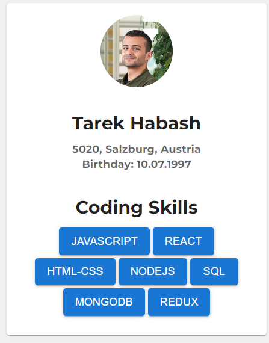

# Business Card React App

This project is a simple React application that displays a business card styled box in the center of the screen. The text inside the box reads "Your business card".

## Screenshot



## Prerequisites

Before you begin, ensure you have met the following requirements:

- You have installed Node.js and npm. You can download them from [nodejs.org](https://nodejs.org/).

## Installation

Follow these steps to set up and run the project:

1. **Clone the repository** (if you haven't already):

```bash
git clone <repository-url>
cd Business-Card-MUI
```

2. **Install dependencies:**

```bash
npm install
```

3. **Run the development server:**

```bash
 npm start
```

4. **Open the app:**
   Open your browser and navigate to http://localhost:3000 to see the business card styled box in the center of the screen.

## Project Structure

- `public/index.html`: The main HTML file that includes the Montserrat font link.
- `src/App.js`: The main React component that renders the `BusinessCard` component.
- `src/BusinessCard.js`: The React component for the business card styled box.
- `src/App.css`: The CSS file for global styles.

## Styling

the Styling was done with the help of MUI library
